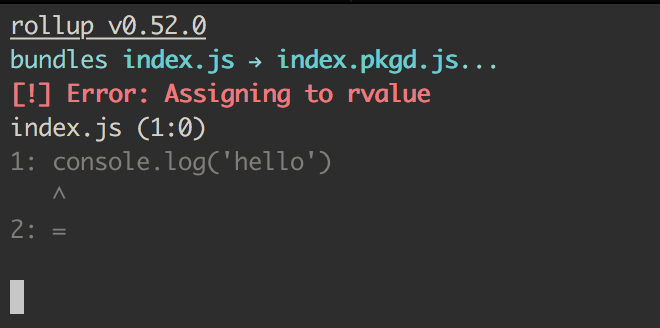
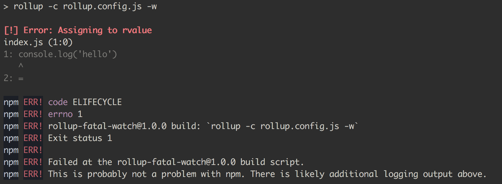

Rollup fatal watch
===

## The problem

If you are running rollup-watch on a file and introduce a syntax error, such as adding a `=` on its own line, you will get a nice console error.

**Note**: It seems the `^` should be on the next line but we'll save that issue for later

If you fix this error, rollup succesfully rebuild and you can go on working.

However, if your file has this error and you try to build for the first time with rollup watch, you'll get a fatal error

## Desired behavior

It would be nice if it didn't exit and let you fix the error, just as how it behaves if you introduce an error while the watch is happening.

## Steps to reproduce

* `npm install`
* `npm run build`

You'll get the fatal error.

Next:

* comment out the `=` in `index.js` and do `npm run build`.
* uncomment the `=` and save

The build recovers.
